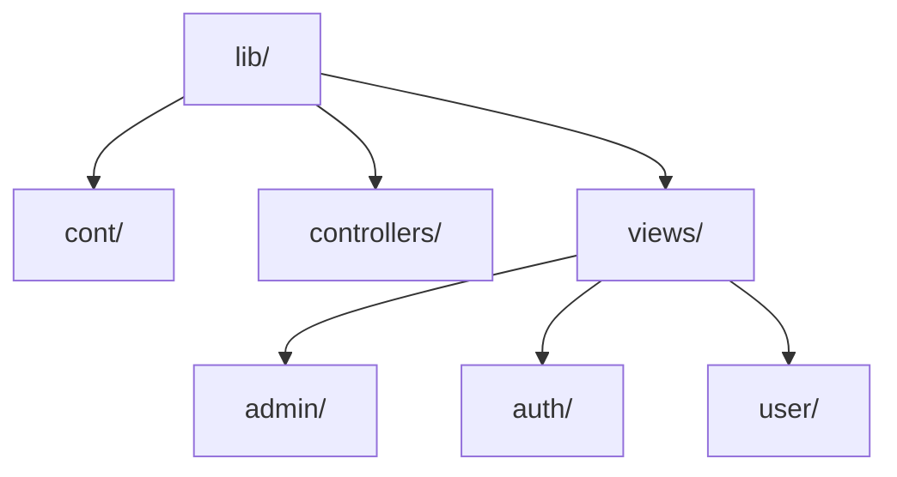

# AI-enabled blood donation mobile application (Life Sync)
This project was my university final year project. It actually was a research project to solve the problem of timely blood donation in Pakistan. In Pakistan, there is no proper platform that would connect blood donors and patients and promote blood donation among the people of Pakistan. Due to the shortage of blood in blood banks, patients suffer health crisis and loss of lives. So we developed this mobile application that would replace legacy systems by finding the best match for users.


## Key Focus Areas
- Primary goal I achieved: Completed my 6 credit hours final year project.
- Unique value I provide: An ML model is integrated in this application that would provide the best and nearby donor or patient to the users according to their profile.


## Features I Implemented

- **Authentication**: Users can create their accounts using and verifying their emails.
- **Geolocator**: Users can find the nearby donors and patients within 15km radius and they can determine their exact location.
- **Blood request**: Users can fill the request form to create a blood request, that would be visible to others.
- **Donor form**: Users can show themselves open for donation by filling the donor form.
- **Donor mode**: Users can toggle donor mode ON and OFF according to their availability. Donor mode of user decides whether he/she is available for donation or not. It can only be toggled when user have filled the donor form.
- **Nearby donors and patients**: Users can enter their blood group and find the ranked list of best matching donors and patients nearby
- **Notifications**: Whenever the request for blood is uploaded, the notification is sent to all the available donors.


## My Tech Stack

**Frontend:**  
Flutter . Dart

**Database:**  
NoSQL · Firebase Cloud


## Installation

Here's how to install my project:

```bash
# Clone my repository
git clone https://github.com/taha-ahmad2002/Blood-Donation-Application.git

# Install dependencies
pub get

# Connect your emulator or mobile device with IDE and run the project
flutter run
```


## Screenshots

### Home
<p align="center">
  
</p>

### Login Page
<p align="center">
  
</p>

### Nearby Donors
<p align="center">
  
</p>

### Profile Page
<p align="center">
  
</p>

### Settings Page
<p align="center">
  
</p>

### Donors Form
<p align="center">
  
</p>


## Prerequisites

Before you begin, ensure you have met the following requirements:
- Flutter >= 3.35.1 • channel stable
- Dart >= 3.9.0
- DevTools >= 2.48.0


## My Project Structure (Mermaid Diagram)

Here's a Mermaid diagram of my code structure:




## Authors

I developed this project with support from:
- [@taha-ahmad2002](https://github.com/taha-ahmad2002) - Lead developer
- [@MuhammadSalmanAhmed](https://github.com/collaborator) - ML developer


## Known Issues

- [ ] ML model hosting: ML model was hosted on Railway and was used remotely by the application. But now the free trial is over and the model is no more hosted by railway. Hence, the donation willingness of nearby donors is not predicatable.
- [ ] Slow keypad: To fill the donor or request form, whenever I click the text bar, the typing keypad appears very slowly. This affects the user experience.


## Contact

Maintainer: [Taha Ahmad](ahmad.taaha2002@gmail.com)
Project Link: [Life Sync](https://github.com/taha-ahmad2002/Blood-Donation-Application.git)


<p align="center">
  Made with ❤️ by taha-ahmad2002.
</p>
